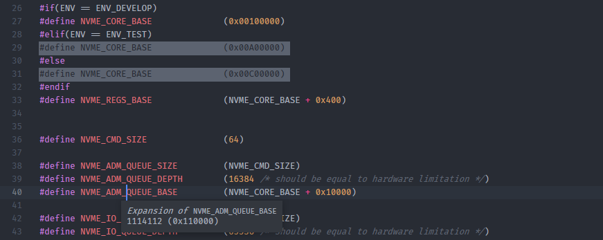
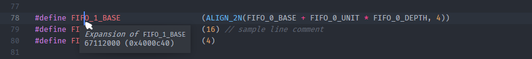
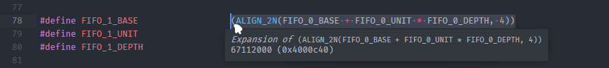
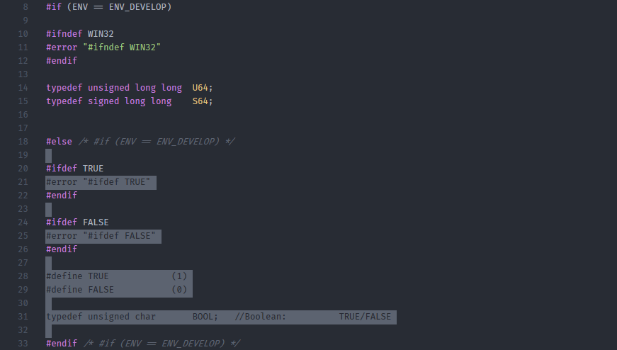
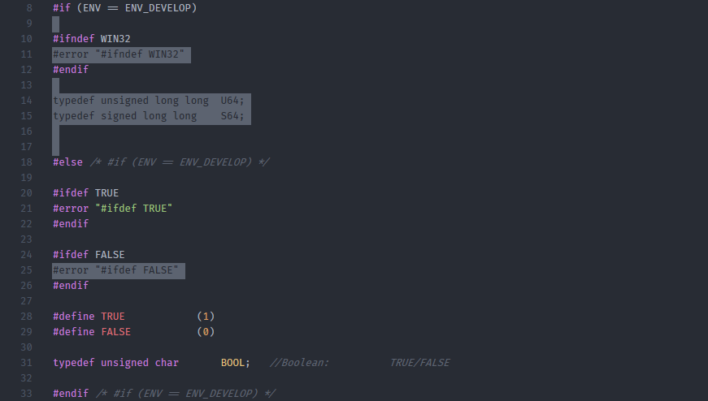

# SublimeText-DefineParser



This is a python parser for calculating C #define values, extended from [ukyouz/C-define-Parser](https://github.com/ukyouz/C-define-Parser).

Support functions:

- Show cursor define value/ all define values
- Parse define values from the folder marked as root
- Mark inactive code under the specified configuration

## Usages

Open a C project folder with Sublime Text, this plugin will start building the define data.

With default settings, parser will lookup the closest parent folder that contains the following root markers.

```json
{
    "define_parser_root_markers": [".root", ".git", ".gitlab"],
}
```

After define data is built, you can enjoy the following features.

### Get the Define Value

By default, you have to manually execute `Define Parser: Calculate #define Value` to get the macro value under cursor. I highly recommend you adding the following configuration in the plugin Mouse Binding file, that you open from Menu -> Preferences -> Package Settings -> Define Parser -> Mouse Bindings.

```json
[
    {
        "button": "button1",
        "count": 1,
        "press_command": "drag_select",
        "modifiers": ["alt"],
        "command": "calculate_define_value"
    },
]
```

Then you can left clicking with `Alt` being pressed to show the calculated value of the define under current cursor position.



Or, drag a selection with `Alt` being pressed.



### Highlight Inactive Code Region

Inactive code region will be highlighted in gray by default.



If you don’t want this behavior at startup, change the follow setting:

```json
{
    "highlight_inactive_enable": true,
}
```

You can also run the `Define Parser: Toggle Highlight for Inactive Code` command to toggle the highlight state for the current window, or use the default keymap `Ctrl-\`.

The inactive code highlighting by default only shown for files with following extensions:

```json
{
    "highlight_inactive_extensions": [".h", ".c", ".cpp"],
}
```

If mismatch happened or the define data is corrupted, try run the `Define Parser: Rebuild #define Data` command to rebuild parsing data.

## Compiler Configurations

For C compiler, some extra defines are specified in the compile command without being written in the source codes. To setup such extra defines, you can simply create a compiler flag file by running `Define Parser: Select Define Configuration` command. Follow the instructions, this plugin help you creating a config file in your root folder. After config file is created, you can choose the configuration you want for more precise parsing result.

The file name will be used as the config name, and for the define parser usage, this plugin only take `-D` options.

After the config selection, it takes a while to rebuild the define data; then the new configuration takes affect and the inactive region changes accordingly.

For example, we specify the `-DENV=ENV_TEST` in our config file:



<hr>

## Limitations/ Known Issues

- Currently only support one folder open in one Sublime Text Window.
- The DEFINITION appears before `#define DEFINITION` will also be seen as a defined value, context order is not well-handled.
- Build define data may be slow (few seconds) for large project, required further optimizations for parsing speed.
